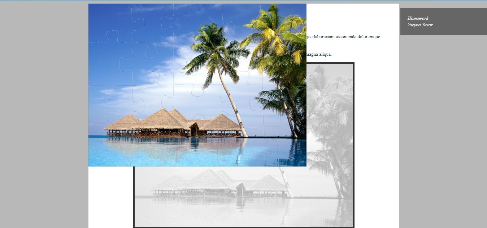

# css-homework-task2
This is my CSS homework (task 2)

1)Give #puzzle block  top:100px; left:100px;  :

2)Give #puzzle block position:absolute  and  top:0px; left:0px;  :

3)Give #puzzle block position:fixed   and  top:0px; left:0px;  :

4)Give #puzzle block position:static   and  top:100px; left:100px;  :

5)Remove in #puzzle block position: relative  and  add position: relative  to #content block  :

